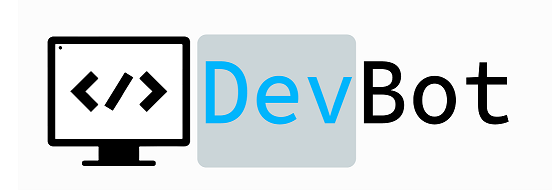

# botkit-webex-devhelpbot



The purpose of this bot is to provide help in developing your first conversational bot in Webex. 
Among its functions the bot can show you the code of each example, provide you guides and the necessary steps to build the bot that best suits your needs.
It is aimed at users with little or no knowledge at all of development.

This bot uses the Botkit framework, a well-tested framework and very popular across platforms.


This project is based on the DevNet [botkit-template](https://www.github.com/CiscoDevNet/botkit-template).


## How to use it?


Talk to the bot at `helpdevbot@webex.bot` in `Webex`!


## Or you can follow this mini-guide:

(remember, a full guide, with gifs, videos, etc at `helpdevbot@webex.bot` in `Webex` ):

You will need 3 things for this to work: Git, Node.Js and a Webex Account:

In the CMD:

  ```sh
    git clone https://github.com/fzicre/Botkit-Webex-DevBot-Template.git

    cd Botkit-Webex-DevBot-Template
    
    npm install
    
  ```
 Then, locate the .env file, and fill this 3 things:
 
  
    WEBEX_ACCESS_TOKEN=

    WEBSOCKET_EVENTS=True

    PORT=3000
    
  Note: The Webex Access Token can be created in the Webex Developer Portal at: https://developer.webex.com/my-apps (Create New App, then select a bot and complete all the fields. The Webex Access Token for that bot will be revealed there.
  
Final step, run the bot:

```sh
    cd Botkit-Webex-DevBot-Template
    
    npm start
```

